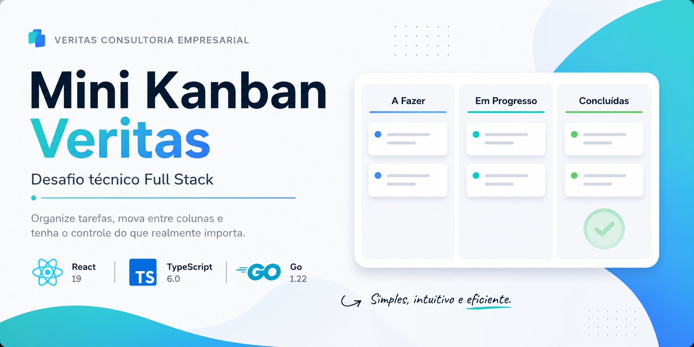
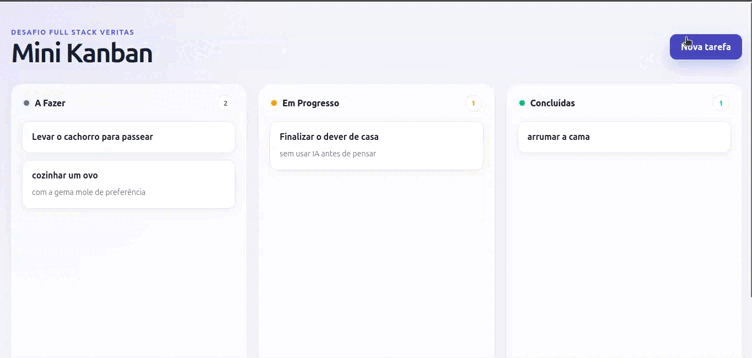
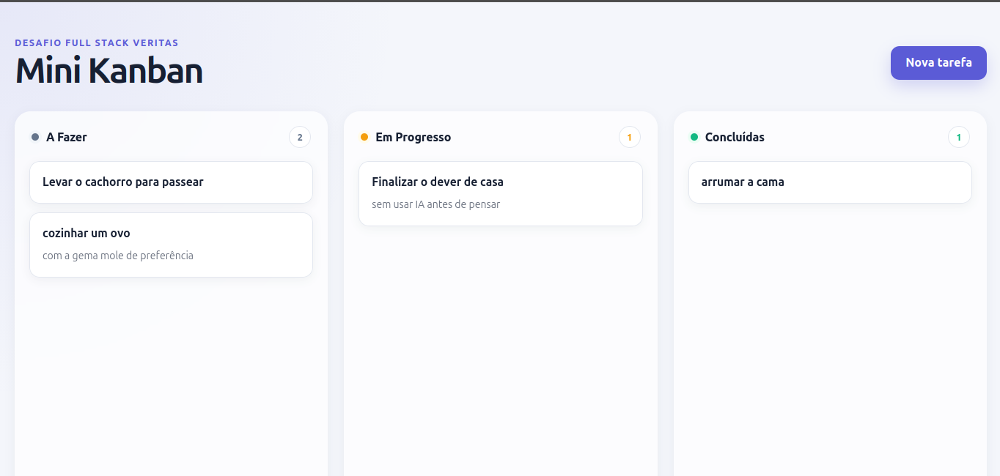
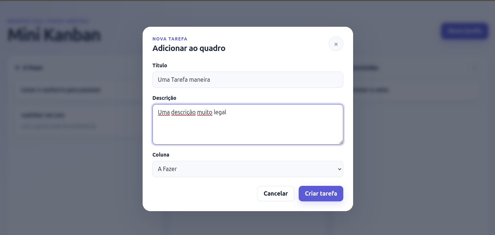
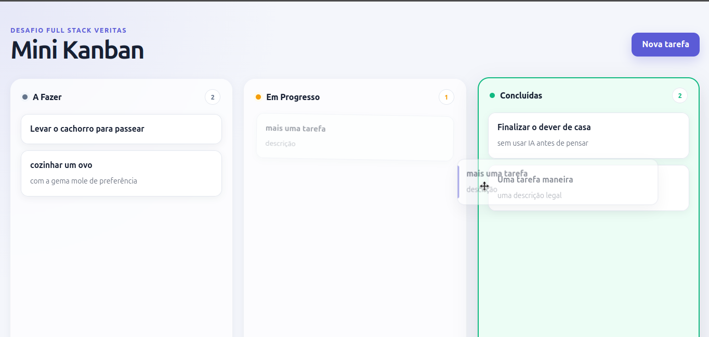
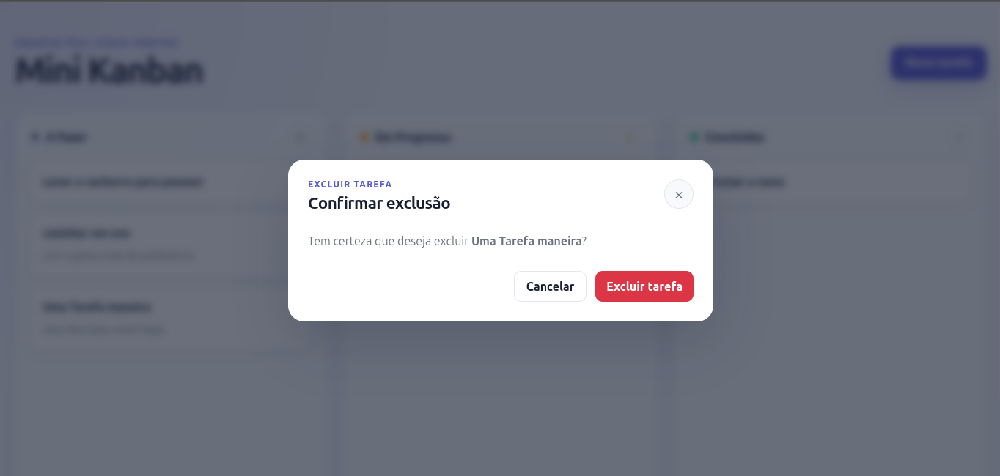
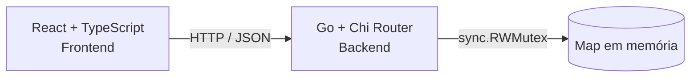

<div align="center">



# 🗂️ Mini Kanban Veritas

**Desafio técnico de estágio Full Stack — Veritas Consultoria Empresarial**

Aplicação full stack para criar, organizar e mover tarefas em um quadro Kanban.


</div>

---

## 📌 Sobre

O Mini Kanban permite criar, editar, mover e excluir tarefas em três colunas fixas:
**A Fazer**, **Em Progresso** e **Concluídas**.

O backend foi desenvolvido em Go e disponibiliza uma API REST. O frontend foi
construído com React e TypeScript e consome essa API para manter o quadro
atualizado durante o uso.

Este repositório é dividido em dois projetos independentes, cada um com seu
próprio README técnico:

- 📦 [`backend/`](./backend/README.md) — API REST em Go
- 🎨 [`frontend/`](./frontend/README.md) — interface em React + TypeScript

---

## 🎬 Aplicação em funcionamento

<p align="center">
  
</p>

A demonstração apresenta o fluxo principal da aplicação: criação, edição,
movimentação por drag-and-drop e exclusão de tarefas.

---

## 📸 Interface da aplicação

<table>
  <tr>
    <td align="center">
      <strong>Quadro Kanban</strong>
      <br><br>
      
    </td>
    <td align="center">
      <strong>Criação de tarefa</strong>
      <br><br>
      
    </td>
  </tr>
  <tr>
    <td align="center">
      <strong>Movimentação entre colunas</strong>
      <br><br>
      
    </td>
    <td align="center">
      <strong>Confirmação de exclusão</strong>
      <br><br>
      
    </td>
  </tr>
</table>

---

## ✨ Funcionalidades

- Três colunas fixas com CRUD completo integrado à API.
- Criação de tarefas com título e descrição opcional.
- Edição de título, descrição e status.
- Movimentação por **drag-and-drop nativo**.
- Alteração de status pelo formulário como alternativa para touch e teclado.
- Criação de tarefas diretamente na coluna desejada pelo botão **+**.
- Confirmação antes da exclusão.
- Feedback contextual contendo o nome da tarefa.
- Mensagens temporárias com fechamento automático ou manual.
- Estados de carregamento, erro com nova tentativa e colunas vazias.
- Navegação e ativação dos cards por teclado com Tab, Enter e Espaço.
- Ordenação estável das tarefas por data de criação.
- Layout responsivo para desktop, tablet e celular.

---

## 🏗️ Arquitetura geral



Cada lado possui sua própria organização interna e suas decisões técnicas
documentadas:

- 📦 [`backend/README.md`](./backend/README.md)
- 🎨 [`frontend/README.md`](./frontend/README.md)

No frontend:

```text
Componentes
    ↓
useTasks
    ↓
taskApi
    ↓
API REST
```

No backend:

```text
Chi Router
    ↓
Handlers HTTP
    ↓
Domain / Repository
    ↓
Map em memória
```

---

## 🧭 User Flow

O User Flow documenta as principais ações realizadas pelo usuário:

- carregar o quadro;
- criar uma tarefa;
- editar uma tarefa;
- mover entre colunas;
- excluir uma tarefa;
- recuperar-se de erros de comunicação.

<p align="center">
  
</p>

Arquivos:

- [`docs/assets/user-flow.png`](./docs/assets/user-flow.png)
- [`docs/user-flow.mmd`](./docs/user-flow.mmd)

---

## 🔄 Data Flow

O Data Flow apresenta a circulação dos dados entre a interface React, o hook
de tarefas, o serviço HTTP, a API em Go e o armazenamento em memória.

<p align="center">
  
</p>

Arquivos:

- [`docs/assets/data-flow.png`](./docs/assets/data-flow.png)
- [`docs/data-flow.mmd`](./docs/data-flow.mmd)

---

## 📁 Estrutura

```text
desafio-fullstack-veritas/
├── backend/
│   ├── cmd/
│   │   └── api/
│   ├── internal/
│   │   ├── domain/
│   │   ├── http/
│   │   └── repository/
│   ├── Dockerfile
│   ├── .dockerignore
│   ├── go.mod
│   ├── go.sum
│   └── README.md
│
├── frontend/
│   ├── src/
│   │   ├── components/
│   │   ├── hooks/
│   │   ├── services/
│   │   ├── types/
│   │   └── utils/
│   ├── Dockerfile
│   ├── .dockerignore
│   ├── nginx.conf
│   ├── package.json
│   └── README.md
│
├── docs/
│   ├── assets/
│   │   ├── banner.png
│   │   ├── demo.gif
│   │   ├── home.png
│   │   ├── create-task.png
│   │   ├── drag-drop.png
│   │   ├── delete-task.png
│   │   ├── user-flow.png
│   │   └── data-flow.png
│   ├── user-flow.mmd
│   └── data-flow.mmd
│
├── docker-compose.yml
└── README.md
```

---

## ▶️ Como executar

### Pré-requisitos

Para a execução manual:

- Go 1.22 ou superior compatível;
- Node.js;
- npm;
- Git.

Para a execução rápida:

- Docker;
- Docker Compose.

### Clonar o repositório

```bash
git clone https://github.com/luis-botelho/desafio-fullstack-veritas.git
cd desafio-fullstack-veritas
```

### Opção rápida com Docker

Com Docker e Docker Compose instalados, execute na raiz do projeto:

```bash
docker compose up --build
```

A aplicação ficará disponível em:

- Frontend: `http://localhost:5173`
- Backend: `http://localhost:8080`

Para encerrar os containers:

```bash
docker compose down
```

O uso de Docker é opcional. Também é possível executar frontend e backend
manualmente.

> O projeto possui Dockerfiles separados para frontend e backend, orquestrados
> pelo `docker-compose.yml`. Essa configuração facilita a avaliação e reduz
> diferenças entre ambientes sem substituir a execução manual.

### Backend — terminal 1

```bash
cd backend
go mod tidy
go run ./cmd/api
```

A API ficará disponível em:

```text
http://localhost:8080
```

Health check:

```bash
curl http://localhost:8080/health
```

### Frontend — terminal 2

```bash
cd frontend
npm install
npm run dev
```

A aplicação ficará disponível em:

```text
http://localhost:5173
```

> O backend precisa permanecer em execução para que o frontend consiga carregar
> e alterar as tarefas.

---

## 🔌 API — resumo

| Método | Rota | Descrição |
|---|---|---|
| `GET` | `/health` | Verifica se a API está no ar |
| `GET` | `/tasks` | Lista as tarefas ordenadas por criação |
| `POST` | `/tasks` | Cria uma tarefa |
| `PUT` | `/tasks/{id}` | Atualiza uma tarefa |
| `DELETE` | `/tasks/{id}` | Exclui uma tarefa |

Detalhes sobre payloads, validações, status HTTP e decisões do backend:

- [`backend/README.md`](./backend/README.md)

### Status disponíveis

| Valor | Coluna |
|---|---|
| `todo` | A Fazer |
| `in_progress` | Em Progresso |
| `done` | Concluídas |

---

## 🧠 Decisões técnicas

### Armazenamento em memória

O edital permite armazenamento em memória ou persistência opcional em JSON.

O armazenamento em memória foi escolhido para manter o MVP simples e concentrar
o desenvolvimento no CRUD, na integração full stack e na experiência de uso.

A limitação assumida é que os dados são perdidos quando o backend é reiniciado.

### Arquitetura em camadas

O backend separa as responsabilidades entre:

- inicialização e rotas;
- comunicação HTTP;
- entidade e validações;
- armazenamento em memória.

Essa divisão melhora a organização e permite testar as regras e o repository sem
subir o servidor HTTP.

### Chi Router

O Chi foi utilizado como roteador leve para declarar rotas RESTful com parâmetros:

```text
PUT /tasks/{id}
DELETE /tasks/{id}
```

### Concorrência

O repository usa `sync.RWMutex`, pois maps em Go não são seguros para escrita
concorrente.

- `RLock` permite múltiplas leituras;
- `Lock` mantém operações de escrita exclusivas.

### Drag-and-drop nativo

A aplicação utiliza a API nativa de drag-and-drop do HTML5, evitando adicionar
uma biblioteca externa apenas para essa interação.

A mudança de status pelo formulário permanece disponível como alternativa para
teclado e dispositivos touch.

### CSS co-localizado

Cada componente React mantém seu arquivo CSS na mesma pasta.

Essa organização facilita localizar os estilos responsáveis por cada elemento e
evita concentrar toda a interface em um único arquivo global.

### Docker Compose

O Docker Compose foi incluído como alternativa de execução para facilitar a
avaliação e padronizar as versões e dependências utilizadas.

A execução manual continua disponível e documentada.

---

## ♿ Acessibilidade

- Cards navegáveis com Tab.
- Abertura dos cards com Enter ou Espaço.
- Indicadores de foco visíveis.
- Campos de formulário associados a labels.
- Modal com `role="dialog"` e `aria-modal="true"`.
- Título do modal associado por `aria-labelledby`.
- Feedbacks anunciados com `role="status"` e `role="alert"`.
- Confirmação antes da exclusão.
- Alternativa ao drag-and-drop pelo campo de status.

---

## 🧪 Testes e validações

### Backend

```bash
cd backend
go fmt ./...
go test ./... -v
go vet ./...
go build ./...
```

A suíte automatizada cobre:

- criação e atualização da entidade;
- título obrigatório;
- status inválido;
- normalização dos dados;
- armazenamento e busca;
- exclusão;
- tarefa inexistente;
- ordenação cronológica.

### Frontend

```bash
cd frontend
npm run lint
npm run build
```

Os fluxos da interface foram validados manualmente durante o desenvolvimento:

- carregamento inicial;
- criação;
- edição;
- movimentação;
- exclusão;
- tratamento de erro;
- responsividade;
- navegação por teclado.

---

## ⚠️ Limitações conhecidas

- Os dados são perdidos quando o backend é reiniciado.
- O drag-and-drop nativo possui suporte limitado em alguns dispositivos touch.
- O frontend ainda não possui testes automatizados de componentes.
- Os handlers HTTP foram validados manualmente, mas ainda não possuem testes
  automatizados específicos.

---

## 🚀 Melhorias futuras

- Persistência com SQLite ou PostgreSQL.
- Identificadores UUID.
- Testes automatizados dos handlers HTTP.
- Testes de componentes no frontend.
- Documentação OpenAPI/Swagger.
- Suporte aprimorado a drag-and-drop em dispositivos touch.
- Retorno de foco ao elemento de origem após fechar modais.

---

## 💡 Considerações

Este projeto foi desenvolvido para o desafio técnico da Veritas Consultoria
Empresarial com foco em entregar um MVP funcional, organizado, documentado e
fácil de executar.

Além do escopo mínimo, foram implementados recursos opcionais como
**drag-and-drop**, **Docker Compose**, **testes automatizados no backend** e o
diagrama complementar de **Data Flow**.

As decisões técnicas priorizaram simplicidade, separação de responsabilidades,
acessibilidade e uma experiência de uso consistente, evitando adicionar
complexidade sem benefício direto para o escopo proposto.

---

## 👨‍💻 Autor

**Luis Botelho**

[GitHub](https://github.com/luis-botelho) ·
[LinkedIn](https://linkedin.com/in/luis-botelho)
