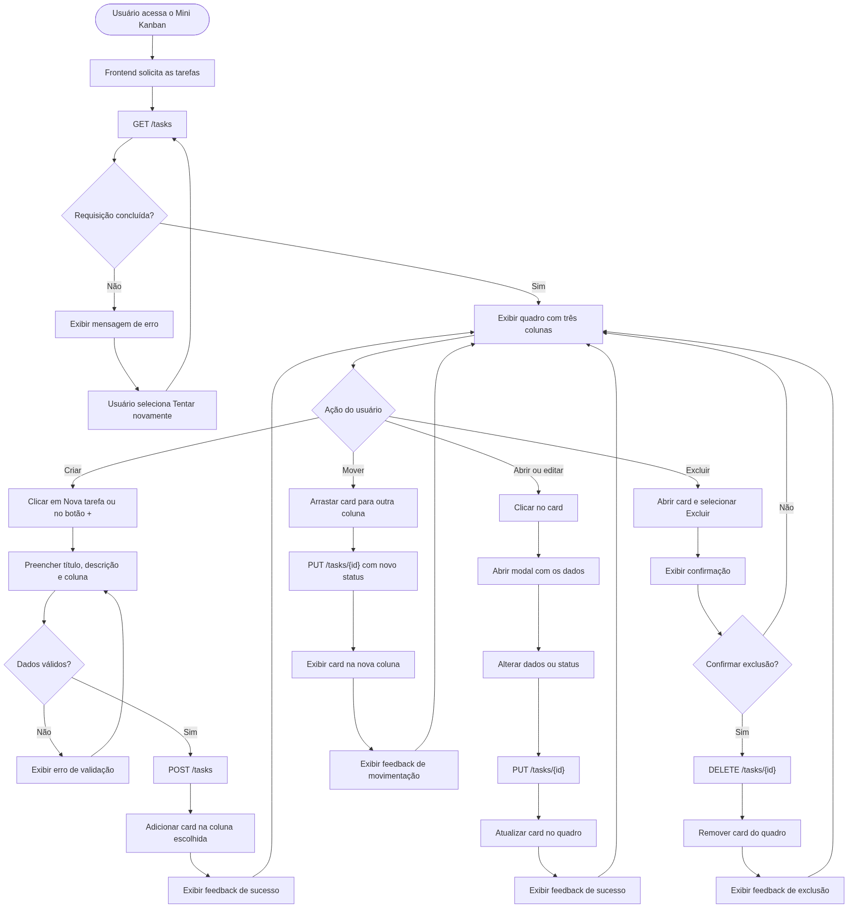
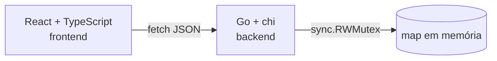

<div align="center">

# 🗂️ Mini Kanban Veritas

**Desafio técnico de estágio Full Stack — Veritas Consultoria Empresarial**

Aplicação full stack para criar, organizar e mover tarefas em um quadro Kanban.


</div>

---

## 📌 Sobre

O Mini Kanban permite criar, editar, mover e excluir tarefas em três colunas fixas
— **A Fazer**, **Em Progresso** e **Concluídas** — com um backend em Go servindo
uma API REST e um frontend em React consumindo essa API em tempo real.

Este repositório é dividido em dois projetos independentes, cada um com seu
próprio README técnico:

- [`backend/`](./backend/README.md) — API REST em Go
- [`frontend/`](./frontend/README.md) — interface em React + TypeScript

## ✨ Funcionalidades

- Três colunas fixas com CRUD completo integrado à API.
- Mover tarefas por **drag-and-drop nativo** ou pelo campo de status no formulário
  (alternativa para touch e teclado).
- Criar tarefa já na coluna desejada (botão **+** no estado vazio de cada coluna).
- Confirmação antes de excluir.
- Feedback contextual com o nome da tarefa ("Tarefa 'X' movida de A Fazer para
  Em Progresso.") e fechamento automático após alguns segundos.
- Estados de carregamento, erro com nova tentativa, e coluna vazia.
- Navegação e ativação dos cards por teclado (Tab, Enter, Espaço).
- Layout responsivo.

## 🧭 Fluxo de uso

Os principais fluxos de criação, edição, movimentação e exclusão estão
documentados em [`docs/user-flow.png`](./docs/user-flow.png),
com o fonte editável em [`docs/user-flow.mmd`](./docs/user-flow.mmd) (sintaxe Mermaid).



## 🏗️ Arquitetura geral



Cada lado tem sua própria organização interna e decisões técnicas específicas,
documentadas nos READMEs individuais — ver [`backend/README.md`](./backend/README.md)
e [`frontend/README.md`](./frontend/README.md).

## 📁 Estrutura

```text
desafio-fullstack-veritas/
├── backend/          # API REST em Go (inclui Dockerfile)
├── frontend/         # Interface em React + TypeScript (inclui Dockerfile, nginx.conf)
├── docs/
│   ├── user-flow.mmd
│   └── user-flow.png
├── docker-compose.yml
└── README.md         # este arquivo
```

## ▶️ Como executar

### Pré-requisitos

- Go 1.22 ou superior
- Node.js e npm
- Git

### Clonar

```bash
git clone https://github.com/luis-botelho/desafio-fullstack-veritas.git
cd desafio-fullstack-veritas
```

### Opção rápida com Docker

Com Docker e Docker Compose instalados, execute na raiz do projeto:

```bash
docker compose up --build
```

A aplicação ficará disponível em:

- Frontend: http://localhost:5173
- Backend: http://localhost:8080

Para encerrar:

```bash
docker compose down
```

O uso de Docker é opcional. Também é possível executar frontend e backend
manualmente, conforme as instruções abaixo.

> Dockerfiles separados para frontend e backend, orquestrados pelo
> `docker-compose.yml` na raiz — só pra facilitar a avaliação e evitar
> diferenças de ambiente, sem substituir a execução manual.

### Backend (terminal 1)

```bash
cd backend
go mod tidy
go run ./cmd/api
```

API disponível em `http://localhost:8080`.

### Frontend (terminal 2)

```bash
cd frontend
npm install
npm run dev
```

Aplicação disponível em `http://localhost:5173`.

> O backend precisa estar rodando para o frontend carregar e alterar tarefas.

## 🔌 API — resumo

| Método | Rota | Descrição |
|---|---|---|
| `GET` | `/health` | Verifica se a API está no ar |
| `GET` | `/tasks` | Lista as tarefas (ordenadas por criação) |
| `POST` | `/tasks` | Cria uma tarefa |
| `PUT` | `/tasks/{id}` | Atualiza uma tarefa |
| `DELETE` | `/tasks/{id}` | Exclui uma tarefa |

Detalhes de payload, validações e status HTTP: [`backend/README.md`](./backend/README.md#-endpoints).

## ♿ Acessibilidade

- Cards navegáveis por Tab, abertos com Enter ou Espaço.
- Modal com `role="dialog"`, `aria-modal="true"` e título associado via `aria-labelledby`.
- Drag-and-drop tem alternativa: mover pelo campo de status no formulário.

## 🧪 Testes

```bash
cd backend && go test ./... -v
```

O backend tem cobertura de domínio e repository (regras de validação, CRUD e
ordenação). **Os handlers HTTP e o frontend ainda não têm testes
automatizados** — validados manualmente durante o desenvolvimento. Está listado
abaixo como próximo passo, não escondido.

## ⚠️ Limitações conhecidas

- Dados em memória: perdidos a cada restart do backend (permitido pelo edital).
- Drag-and-drop nativo tem suporte limitado em alguns dispositivos touch — por
  isso existe a alternativa pelo formulário.
- Sem testes automatizados de handler HTTP e de componentes do frontend.

## 🚀 Melhorias futuras

- Persistência em JSON ou banco de dados.
- IDs via UUID.
- Testes automatizados de handlers e de componentes.
- Documentação OpenAPI/Swagger.
- Diagrama de data flow complementar ao user-flow.

## 👨‍💻 Autor

**Luis Botelho**
[GitHub](https://github.com/luis-botelho) · [LinkedIn](https://linkedin.com/in/luis-botelho)