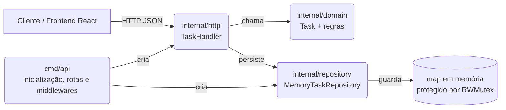

<div align="center">

# 🗂️ Mini Kanban — Backend

**API REST em Go para o desafio Full Stack — Veritas Consultoria Empresarial**


</div>

---

## 📌 Sobre

API responsável pela persistência e regras de negócio das tarefas do Mini Kanban.
Recebe requisições REST do frontend (React), aplica validações de domínio e mantém
o estado em memória, protegido contra acesso concorrente.

> Este README documenta **o quê**, **como** e **por quê**. As decisões técnicas ficam
> registradas para a fase oral — não só "funciona", mas "funciona e eu sei explicar".

## Sumário

- [Arquitetura](#-arquitetura)
- [Stack](#-stack)
- [Estrutura de pastas](#-estrutura-de-pastas)
- [Como rodar](#-como-rodar)
- [Endpoints](#-endpoints)
- [Regras de negócio](#-regras-de-negócio)
- [Decisões técnicas](#-decisões-técnicas)
- [Testes](#-testes)
- [Roadmap](#-roadmap)

## 🏗️ Arquitetura

O backend utiliza **arquitetura em camadas com separação de responsabilidades**.



| Camada | Responsabilidade |
|---|---|
| `domain` | Entidade `Task` e validações |
| `repository` | Armazenamento em memória e controle de concorrência |
| `http` | Entrada e saída HTTP |
| `cmd/api` | Inicialização, rotas e middlewares |

## 🧰 Stack

- **Go 1.22**
- [chi](https://github.com/go-chi/chi) — roteador HTTP minimalista
- [go-chi/cors](https://github.com/go-chi/cors) — middleware de CORS
- Armazenamento em memória (`map` + `sync.RWMutex`)

## 📁 Estrutura de pastas

```text
backend/
├── cmd/
│   └── api/
│       └── main.go                        # bootstrap: router, middlewares, rotas
├── internal/
│   ├── domain/
│   │   ├── task.go                        # entidade Task + regras de validação
│   │   └── task_test.go
│   ├── http/
│   │   └── task_handler.go                # handlers HTTP (decode → domain → encode)
│   └── repository/
│       ├── memory_task_repository.go      # storage em memória, thread-safe
│       └── memory_task_repository_test.go
├── go.mod
└── go.sum
```

## ▶️ Como rodar

```bash
cd backend
go mod tidy
go run ./cmd/api
```

A API sobe em:

```text
http://localhost:8080
```

<details>
<summary><strong>Testando rapidamente com curl</strong></summary>

```bash
# healthcheck
curl http://localhost:8080/health

# criar tarefa
curl -X POST http://localhost:8080/tasks \
  -H "Content-Type: application/json" \
  -d '{"title":"Estudar Go","description":"Revisar concorrência","status":"todo"}'

# listar tarefas
curl http://localhost:8080/tasks
```

</details>

## 🔌 Endpoints

| Método | Rota | Descrição | Corpo esperado |
|---|---|---|---|
| `GET` | `/health` | Verifica se a API está no ar | — |
| `GET` | `/tasks` | Lista todas as tarefas | — |
| `POST` | `/tasks` | Cria uma tarefa | `{ "title", "description", "status" }` |
| `PUT` | `/tasks/{id}` | Atualiza uma tarefa existente | `{ "title", "description", "status" }` |
| `DELETE` | `/tasks/{id}` | Remove uma tarefa | — |

**Status possíveis** (colunas do Kanban):

| Valor | Coluna |
|---|---|
| `todo` | A Fazer |
| `in_progress` | Em Progresso |
| `done` | Concluídas |

## ✅ Regras de negócio

- `title` é obrigatório (espaços em branco não contam como título válido).
- `status` precisa ser um dos três valores válidos — qualquer outro retorna `400`.
- Título e descrição são normalizados no domínio com `strings.TrimSpace`.
- `createdAt` e `updatedAt` são controlados pelo domínio, nunca pelo cliente.

## 🧠 Decisões técnicas

Registrado aqui porque a fase oral pede exatamente isso: argumentar as escolhas.

- **Por que camadas separadas em vez de tudo no `main.go`?**
  Porque o handler não deveria saber *como* uma tarefa é validada, e o domínio não
  deveria saber que existe HTTP. Isso deixa o domínio testável sem subir servidor.

- **Por que `sync.RWMutex` no repository?**
  `map` em Go **não é thread-safe**. O servidor HTTP do Go atende cada requisição em
  sua própria goroutine, então duas requisições simultâneas de escrita — ou uma
  leitura durante uma escrita — causam *data race*. O `RWMutex` permite múltiplas
  leituras concorrentes (`RLock`) mas serializa escritas (`Lock`).

- **Por que armazenamento em memória e não banco de dados?**
  O escopo do desafio (MVP) pede simplicidade e foco no fluxo fullstack, não em
  persistência. Para o escopo atual, o repository em memória atende ao fluxo do CRUD
  sem adicionar infraestrutura ou dependências.

- **Trade-off assumido:** os dados são perdidos a cada restart do servidor. Documentado
  para não parecer descuido — é escopo, não esquecimento.

## 🧪 Testes

```bash
go test ./... -v
go build ./...
```

Cobertura atual: regras de validação do domínio (`task_test.go`) e operações de
salvar, buscar, listar em ordem, excluir e tratar tarefa inexistente no repository
(`memory_task_repository_test.go`).

## 🗺️ Roadmap

- [x] CRUD completo de tarefas
- [x] Validações de domínio
- [x] Thread-safety no armazenamento
- [x] Testes unitários
- [x] Ordenação estável na listagem (`createdAt`)
- [ ] IDs via UUID em vez de timestamp
- [ ] Documentação OpenAPI/Swagger

---

<div align="center">

Desenvolvido por **Luis Botelho** · [GitHub](https://github.com/luis-botelho) · [LinkedIn](https://linkedin.com/in/luis-botelho)

</div>
