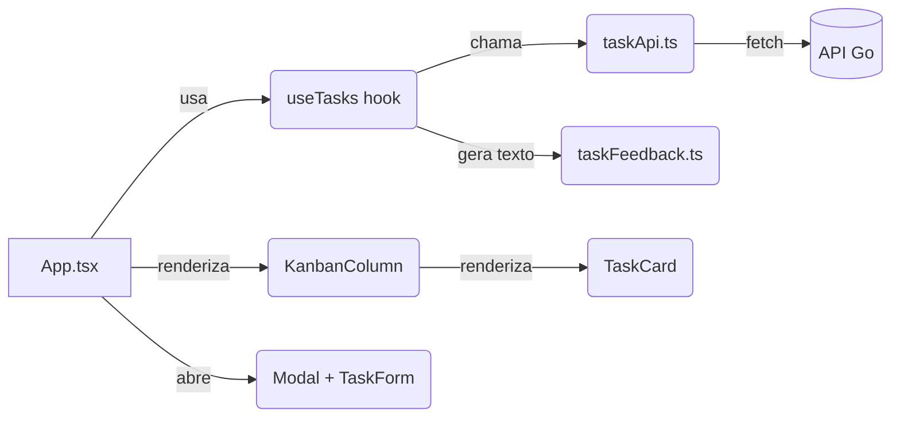

<div align="center">

# 🎨 Mini Kanban — Frontend

**Interface em React + TypeScript para o desafio Full Stack — Veritas Consultoria Empresarial**


</div>

---

## 📌 Sobre

Interface do Mini Kanban: três colunas fixas, CRUD de tarefas, movimentação por
drag-and-drop e feedback contextual para cada ação. Consome a API Go documentada
em [`../backend/README.md`](../backend/README.md).

## Sumário

- [Stack](#-stack)
- [Estrutura de pastas](#-estrutura-de-pastas)
- [Como rodar](#-como-rodar)
- [Fluxo de dados](#-fluxo-de-dados)
- [Decisões técnicas](#-decisões-técnicas)
- [Acessibilidade](#-acessibilidade)
- [Limitações conhecidas](#-limitações-conhecidas)

## 🧰 Stack

- **React 19** + **TypeScript**
- **Vite** — dev server e build
- CSS puro, co-localizado por componente
- `fetch` nativo para comunicação com a API (sem lib de requisição)

## 📁 Estrutura de pastas

```text
frontend/
└── src/
    ├── components/
    │   ├── KanbanColumn/     # coluna com estado vazio e botão de criação rápida
    │   ├── Modal/            # modal genérico e acessível (role="dialog")
    │   ├── TaskCard/         # card arrastável e clicável
    │   └── TaskForm/         # formulário de criação/edição
    ├── hooks/
    │   └── useTasks.ts       # estado global das tarefas + chamadas à API
    ├── services/
    │   └── taskApi.ts        # camada de comunicação HTTP
    ├── types/
    │   └── task.ts           # contratos TypeScript (Task, CreateTaskInput...)
    ├── utils/
    │   └── taskFeedback.ts   # gera as mensagens de feedback contextual
    ├── App.tsx                # composição das colunas, modais e estado de UI
    └── main.tsx
```

Cada componente mantém seu próprio arquivo `.css` na mesma pasta — decisão
explicada em [Decisões técnicas](#-decisões-técnicas).

## ▶️ Como rodar

```bash
cd frontend
npm install
npm run dev
```

Aplicação em `http://localhost:5173`. **O backend precisa estar rodando** em
`http://localhost:8080` — sem ele, a tela fica no estado de carregamento/erro.

```bash
npm run build   # build de produção (tsc -b && vite build)
npm run lint    # eslint
```

## 🔄 Fluxo de dados



`useTasks` concentra todo o estado (`tasks`, `isLoading`, `isSubmitting`, `error`,
`successMessage`) e expõe funções (`createTask`, `updateTask`, `deleteTask`).
`App.tsx` só orquestra: decide qual modal está aberto e passa os dados adiante.
Nenhum componente de UI fala com a API diretamente.

## 🧠 Decisões técnicas

- **Clique abre, arrastar move.** O `TaskCard` distingue os dois gestos com uma
  `ref` (`wasDragged`) marcada em `onDragStart` e limpa logo após `onDragEnd`:
  se o usuário estava arrastando, o `onClick` disparado ao soltar é ignorado, e
  o modal só abre em clique "de verdade".

- **`role="button"` + `tabIndex={0}` no card.** Como o card clicável é uma
  `<article>`, não um `<button>` nativo, a semântica de acessibilidade (leitor
  de tela, ativação por Enter/Espaço) precisa ser declarada manualmente.

- **Drag-and-drop nativo do HTML5, sem lib.** `draggable`, `onDragStart`,
  `onDragOver` (com `preventDefault`, senão o navegador recusa o drop) e
  `onDrop`. Suficiente para o escopo do desafio e sem dependência extra — o
  trade-off é suporte limitado em touch, coberto pela alternativa no formulário.

- **`PUT` sempre reenvia o objeto completo.** Como a API não faz PATCH parcial,
  mover uma tarefa por drag-and-drop busca a tarefa atual e reenvia
  `title`/`description` originais só trocando o `status` — decisão do backend
  refletida no client, não uma escolha isolada do frontend.

- **CSS co-localizado por componente**, em vez de um arquivo global único.
  Facilita achar, alterar e remover estilo de um componente sem procurar em
  um CSS monolítico.

- **Mensagens de feedback geradas em função pura** (`taskFeedback.ts`),
  separadas do hook. `useTasks` decide *quando* mostrar uma mensagem;
  `taskFeedback` decide *o que* a mensagem diz. Isso é testável sem estado
  de React envolvido.

## ♿ Acessibilidade

- Cards navegáveis por Tab, ativados com Enter ou Espaço.
- Modal com `role="dialog"`, `aria-modal="true"` e `aria-labelledby` apontando
  para o título.
- Fechar modal clicando fora (`onMouseDown` no backdrop) ou no botão `×` com
  `aria-label`.
- Alternativa ao drag-and-drop: campo de status no formulário, acessível por
  teclado.

## ⚠️ Limitações conhecidas

- Sem testes automatizados de componente (validado manualmente).
- Drag-and-drop nativo do HTML5 tem suporte limitado em dispositivos touch.
- Sem virtualização de lista — não é um problema no volume de dados do desafio,
  mas não escalaria para milhares de tarefas por coluna sem ajuste.

---

<div align="center">

Desenvolvido por **Luis Botelho** · [GitHub](https://github.com/luis-botelho) · [LinkedIn](https://linkedin.com/in/luis-botelho)

</div>
